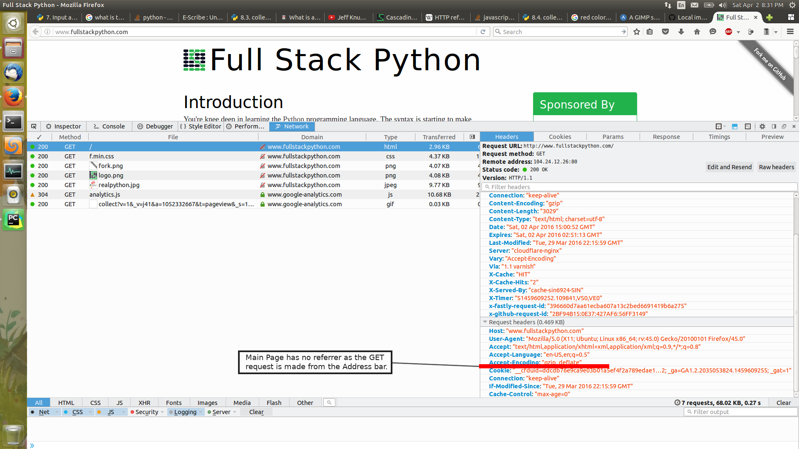
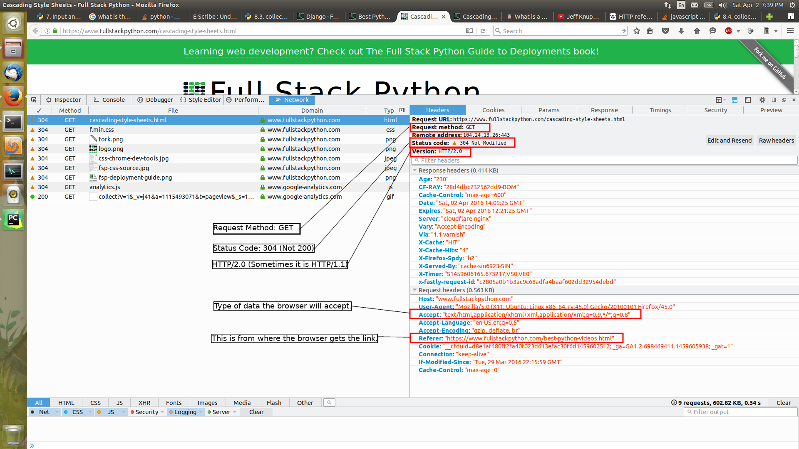
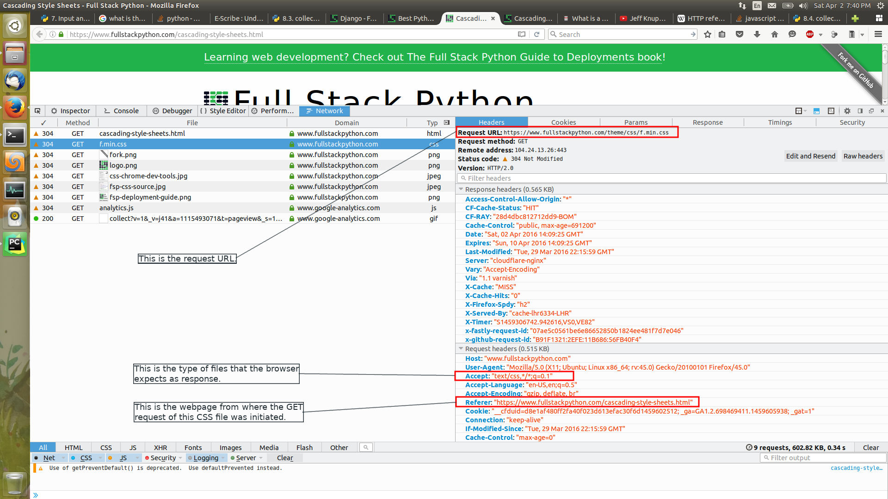
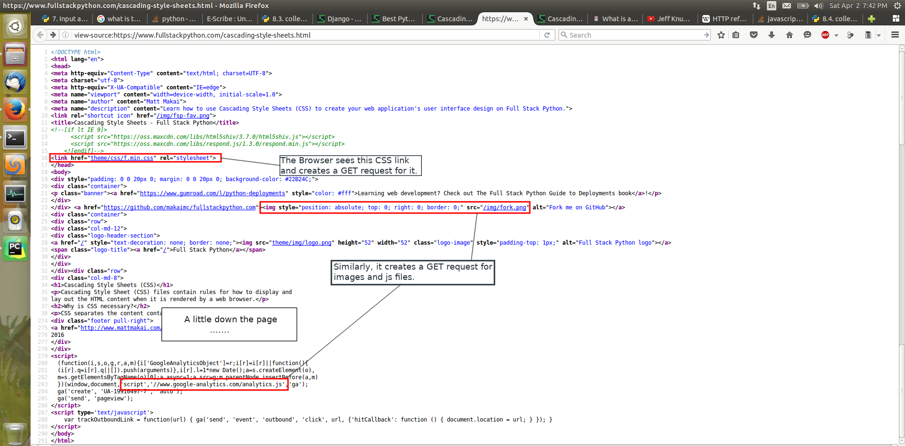

### Entering a URL in Address bar

Whenever you enter a URL in the Address bar of a browser and press enter,
the browser makes a `GET` request to the *web server* with the given URL.

This is how the `request` looks along with the `request and response headers`.

(There are a number of other *requests* apart from the type html request.
We will talk about that and the *Referrer* later.)

### Navigating to a link from a web page

Whenever, we browse to a page clicking a link from another webpage, a `GET` request is
made by the browser.

As we can see, there is the request method `GET`, the Response code `304` (it is usually `200`
which means everything is OK).

The request header also specifies the `Accept` i.e. what
kind of files/data the browser will *accept* for this `GET` request.
Here, the browser will expect an HTML page in response to the `GET` request.

It also has a `Referrer` which means where this `GET` request was generated from.
This field would be blank (as in the above image where we directly enter a URL in address bar)
OR would contain the name of the web page from where *this* web page was loaded.

### CSS loading by the web page.

Now, as the browser starts parsing the HTML file received from the server after a `GET` request;
it encounters different types of files like `.css`, images like `.png`, `.jpg`, `.js` files etc.

It initiates a `GET` request for each of this files/URLs.

#### Source of the web page and different files/URLs for which `HTTP` requests were made

This shows the different files/URLs that need to be downloaded along with the HTML page
that was given by the browser on the `GET` request of the HTML page.

